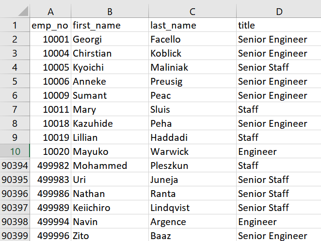
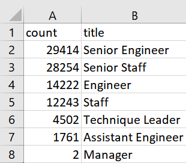
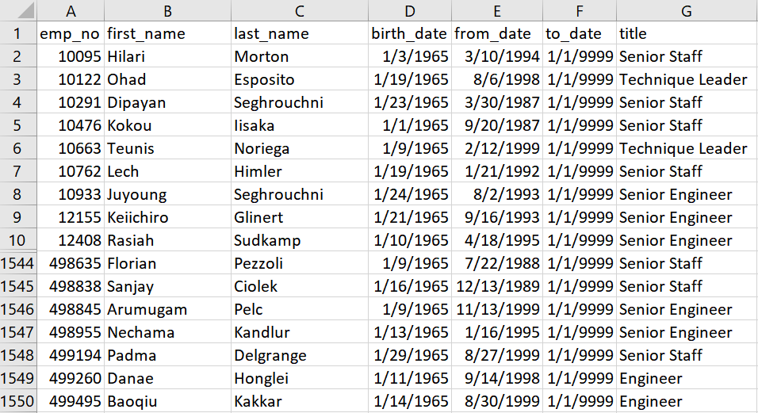

# Pewlett-Hackard-Analysis

## Project Overview
The purpose of this project was to analyze employee retirement data at Pewlett-Hackard. By generating a list of all employees who are eligible for the retirement package, the findings could then be used to help the company prepare for future vacancies. The objective of the challenge was to:

- Determine the number of retiring employees per title
- Identify employees who are eligible to participate in a mentorship program.

## Resources
- Data Sources: [mentorship_eligibility.csv](Data/mentorship_eligibility.csv); [retirement_titles.csv](Data/retirement_titles.csv); [retiring_titles.csv](Data/retiring_titles.csv); [unique_titles.csv](Data/unique_titles.csv)
- Software: PostgreSQL and pgAdmin

## Results
According to the analysis,
 
**Total Retiring**
 

- 90,398 employees born between 1952 and 1955 are eligible for retirement.

**Retiring Titles**
 

- 29,414 of those eligible for retirement hold the title of Senior Engineer.
- 14,222 are Engineers, 4,502 are Staff, and 2 are Managers.

**Mentorship Eligible**
 

- 1,550 of the employees eligible for retirement are also eligible for the Mentorship Program.

## Summary
