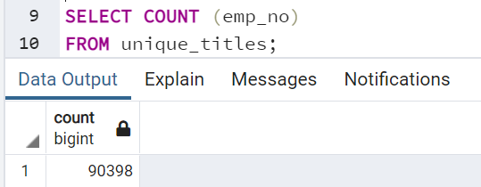
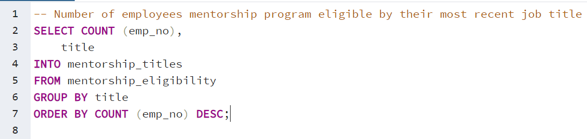
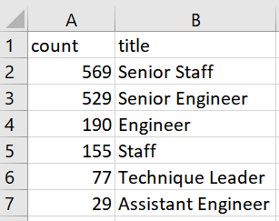

# Pewlett-Hackard-Analysis

## Project Overview
The purpose of this project was to analyze employee retirement data at Pewlett-Hackard. By generating a list of all employees who are eligible for the retirement package, the findings could then be used to help the company prepare for future vacancies. The objective of the challenge was to:

- Determine the number of retiring employees per title
- Identify employees who are eligible to participate in a mentorship program.

## Resources
- Data Sources: [mentorship_eligibility.csv](Data/mentorship_eligibility.csv); [retirement_titles.csv](Data/retirement_titles.csv); [retiring_titles.csv](Data/retiring_titles.csv); [unique_titles.csv](Data/unique_titles.csv)
- Software: PostgreSQL and pgAdmin

## Results
According to the analysis,
- 90,398 employees born between 1952 and 1955 are eligible for retirement.

**Firgure 1: Retiring Titles**
 

- 29,414 of those eligible for retirement hold the title of Senior Engineer.
- 14,222 are Engineers, 4,502 are Staff, and 2 are Managers.

**Figure 2: Mentorship Eligible**
 

- 1,550 of the employees are eligible for the Mentorship Program.

## Summary
**How many roles will need to be filled as the "silver tsunami" begins to make an impact?**
 
- As the "silver tsumani" begins, 90,398 roles will need to be filled. This was found by using the following query:
 

**Figure 3: Total Retiring**

 

 

**Are there enough qualified, retirement-ready employees in the departments to mentor the next generation of Pewlett Hackard employees?**
 
- There are enough retirement-ready employees all departments to mentor the next generation of employees. This was found using the following query:
 

**Figure 4: Mentorship-Eligible by Title Query**

 

 

 

**Figure 5: Mentorship-Eligible by Title Chart**

 

 
When compared to Figure 1, it is apparent that there are enough retirement-eligible employees in all departments to mentor their replacements.

## Conclusion
Based on the overall analysis, it can be concluded that Pewlett Hackard will be able to successfully replace its retiring employees without any issues. There are enough staff to train and mentor new employees before retiring.
